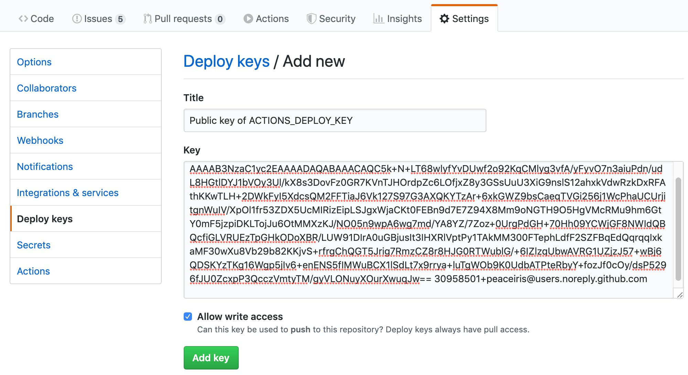
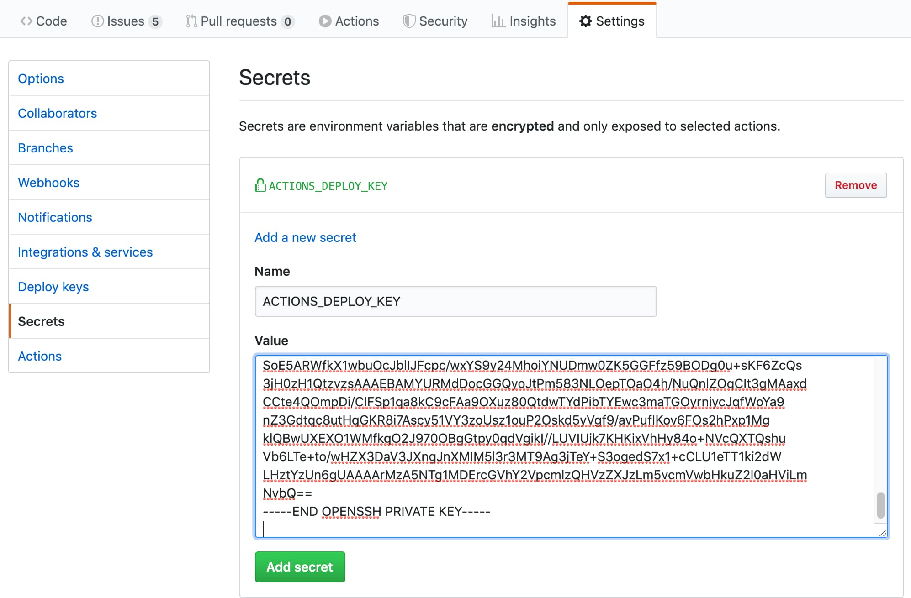
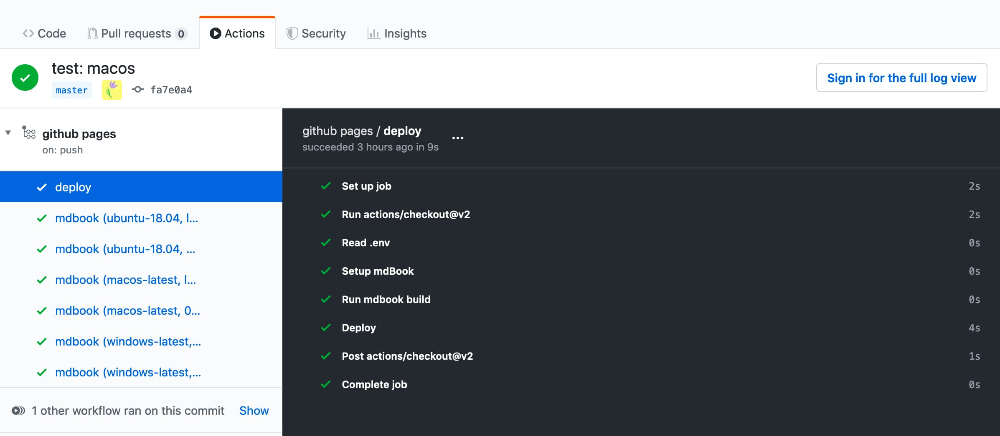

[](https://github.com/peaceiris/actions-gh-pages/blob/master/LICENSE)
[](https://github.com/peaceiris/actions-gh-pages/releases/latest)
[](https://github.com/peaceiris/actions-gh-pages/releases)

[](https://github.com/peaceiris/actions-gh-pages/releases.atom)
[](https://dependabot.com)


> This Action has been migrated to a TypeScript Action (version 3).
>
> The old Docker Action is [peaceiris/actions-gh-pages@v2](https://github.com/peaceiris/actions-gh-pages/tree/v2)


## GitHub Actions for GitHub Pages

This is a **GitHub Action** to deploy your static files to **GitHub Pages**.
This deploy action can be combined simply and freely with [Static Site Generators]. (Hugo, MkDocs, Gatsby, GitBook, mdBook, etc.)

[Static Site Generators]: https://www.staticgen.com/

The next example step will deploy `./public` directory to the remote `gh-pages` branch.


```yaml
- name: Deploy
  uses: peaceiris/actions-gh-pages@v3
  with:
    deploy_key: ${{ secrets.ACTIONS_DEPLOY_KEY }}
    # github_token: ${{ secrets.GITHUB_TOKEN }}
    # personal_token: ${{ secrets.PERSONAL_TOKEN }}
    publish_dir: ./public
```

Three tokens are supported.

| Token | Private repo | Public repo | Protocol | Setup |
|---|:---:|:---:|---|---|
| `github_token` | ✅️ | (1) | HTTPS | Unnecessary |
| `personal_token` | ✅️ | ✅️ | HTTPS | Necessary |
| `deploy_key` | ✅️ | ✅️ | SSH | Necessary |

1. Currently, GitHub Actions does not support to trigger a GitHub Pages build event using GITHUB_TOKEN on a public repository.


## Table of Contents

<!-- START doctoc generated TOC please keep comment here to allow auto update -->
<!-- DON'T EDIT THIS SECTION, INSTEAD RE-RUN doctoc TO UPDATE -->


- [Getting started](#getting-started)
  - [(1) Add SSH deploy key](#1-add-ssh-deploy-key)
  - [(2) Create your workflow](#2-create-your-workflow)
    - [⭐️ Repository type - Project](#%EF%B8%8F-repository-type---project)
    - [⭐️ Repository type - User and Organization](#%EF%B8%8F-repository-type---user-and-organization)
- [Options](#options)
  - [⭐️ `personal_token`](#%EF%B8%8F-personal_token)
  - [⭐️ `github_token`](#%EF%B8%8F-github_token)
  - [⭐️ Allow empty commits](#%EF%B8%8F-allow-empty-commits)
  - [⭐️ Keeping existing files](#%EF%B8%8F-keeping-existing-files)
  - [⭐️ Deploy to external repository](#%EF%B8%8F-deploy-to-external-repository)
  - [⭐️ Force orphan](#%EF%B8%8F-force-orphan)
  - [⭐️ Set Git username and email](#%EF%B8%8F-set-git-username-and-email)
  - [⭐️ Set custom commit message](#%EF%B8%8F-set-custom-commit-message)
  - [⭐️ Create Git tag](#%EF%B8%8F-create-git-tag)
- [Tips and FAQ](#tips-and-faq)
  - [⭐️ Use the latest and specific release](#%EF%B8%8F-use-the-latest-and-specific-release)
  - [⭐️ How to add `CNAME`](#%EF%B8%8F-how-to-add-cname)
  - [⭐️ Deployment completed but you cannot read](#%EF%B8%8F-deployment-completed-but-you-cannot-read)
- [Examples](#examples)
  - [⭐️ Static Site Generators with Node.js](#%EF%B8%8F-static-site-generators-with-nodejs)
  - [⭐️ Gatsby](#%EF%B8%8F-gatsby)
  - [⭐️ React and Next](#%EF%B8%8F-react-and-next)
  - [⭐️ Vue and Nuxt](#%EF%B8%8F-vue-and-nuxt)
  - [⭐️ Static Site Generators with Python](#%EF%B8%8F-static-site-generators-with-python)
  - [⭐️ mdBook (Rust)](#%EF%B8%8F-mdbook-rust)
  - [⭐️ Flutter Web](#%EF%B8%8F-flutter-web)
  - [⭐️ Elm](#%EF%B8%8F-elm)
- [License](#license)
- [About the author](#about-the-author)

<!-- END doctoc generated TOC please keep comment here to allow auto update -->


## Getting started

### (1) Add SSH deploy key

Generate your deploy key with the following command.

```sh
ssh-keygen -t rsa -b 4096 -C "$(git config user.email)" -f gh-pages -N ""
# You will get 2 files:
#   gh-pages.pub (public key)
#   gh-pages     (private key)
```

Next, Go to **Repository Settings**

- Go to **Deploy Keys** and add your public key with the **Allow write access**
- Go to **Secrets** and add your private key as `ACTIONS_DEPLOY_KEY`

| Add your public key | Success |
|---|---|
|  |  |

| Add your private key | Success |
|---|---|
|  |  |

### (2) Create your workflow

Add your workflow setting YAML file `.github/workflows/gh-pages.yml` and push to the default branch.

#### ⭐️ Repository type - Project

An example workflow for Hugo.

- [peaceiris/actions-hugo: GitHub Actions for Hugo](https://github.com/peaceiris/actions-hugo)

[](https://github.com/peaceiris/actions-hugo)


```yaml
name: github pages

on:
  push:
    branches:
      - master

jobs:
  build-deploy:
    runs-on: ubuntu-18.04
    steps:
      - uses: actions/checkout@v1
        # with:
        #   submodules: true

      - name: Setup Hugo
        uses: peaceiris/actions-hugo@v2
        with:
          hugo-version: '0.64.0'

      - name: Build
        run: hugo --minify

      - name: Deploy
        uses: peaceiris/actions-gh-pages@v3
        with:
          deploy_key: ${{ secrets.ACTIONS_DEPLOY_KEY }}
          publish_dir: ./public
```

The above example is for [Project Pages sites]. (`<username>/<project_name>` repository)

| Actions log overview | Build step log |
|---|---|
|  |  |

| Deploy step log | GitHub Pages log |
|---|---|
|  |  |

#### ⭐️ Repository type - User and Organization

For [User and Organization Pages sites] (`<username>/<username>.github.io` repository),
we have to set `master` branch to `PUBLISH_BRANCH`.

```yaml
on:
  push:
    branches:
      - source  # default branch

publish_branch: master  # deploying branch
```

[Project Pages sites]: https://help.github.com/en/articles/user-organization-and-project-pages#project-pages-sites
[User and Organization Pages sites]: https://help.github.com/en/articles/user-organization-and-project-pages#user-and-organization-pages-sites


<div align="right">
<a href="#table-of-contents">Back to TOC ☝️</a>
</div>


## Options

### ⭐️ `personal_token`

[Generate a personal access token (`repo`)](https://github.com/settings/tokens) and add it to Secrets as `PERSONAL_TOKEN`, it works as well as `ACTIONS_DEPLOY_KEY`.

```diff
- deploy_key: ${{ secrets.ACTIONS_DEPLOY_KEY }}
+ personal_token: ${{ secrets.PERSONAL_TOKEN }}
```

### ⭐️ `github_token`

> ⚠️ **NOTES**: `github_token` works only on a **private** repository.
>
> This action supports `GITHUB_TOKEN` but it has some problems to deploy to GitHub Pages. GitHub team is investigating that. See [Issue #9]

[Issue #9]: https://github.com/peaceiris/actions-gh-pages/issues/9

```diff
- deploy_key: ${{ secrets.ACTIONS_DEPLOY_KEY }}
+ github_token: ${{ secrets.GITHUB_TOKEN }}
```

### ⭐️ Allow empty commits

By default, a commit will not be generated when no file changes. If you want to allow an empty commit, set the optional parameter `allow_empty_commit` to `true`.

For example:

```yaml
- name: Deploy
  uses: peaceiris/actions-gh-pages@v3
  with:
    deploy_key: ${{ secrets.ACTIONS_DEPLOY_KEY }}
    publish_dir: ./public
    allow_empty_commit: true
```

### ⭐️ Keeping existing files

By default, existing files in the publish branch are removed before adding the ones from publish dir. If you want the action to add new files but leave existing ones untouched, set the optional parameter `keep_files` to `true`.

For example:

```yaml
- name: Deploy
  uses: peaceiris/actions-gh-pages@v3
  with:
    deploy_key: ${{ secrets.ACTIONS_DEPLOY_KEY }}
    publish_dir: ./public
    keep_files: true
```

### ⭐️ Deploy to external repository

By default, your files are published to the repository which is running this action.
If you want to publish to another repository on GitHub, set the environment variable `external_repository` to `<username>/<external-repository>`.

For example:

```yaml
- name: Deploy
  uses: peaceiris/actions-gh-pages@v3
  with:
    deploy_key: ${{ secrets.ACTIONS_DEPLOY_KEY }}
    external_repository: username/external-repository
    publish_branch: gh-pages
    publish_dir: ./public
```

You can use `deploy_key` or `personal_token`.
When you use `deploy_key`, set your private key to the repository which includes this action and set your public key to your external repository.

Be careful, `GITHUB_TOKEN` has no permission to access to external repositories.

### ⭐️ Force orphan

We can set the `force_orphan: true` option.
This allows you to make your publish branch with only the latest commit.

```yaml
- name: Deploy
  uses: peaceiris/actions-gh-pages@v3
  with:
    deploy_key: ${{ secrets.ACTIONS_DEPLOY_KEY }}
    publish_dir: ./public
    force_orphan: true
```

### ⭐️ Set Git username and email

Set custom `git config user.name` and `git config user.email`.
A commit is always created with the same user.

```yaml
- name: Deploy
  uses: peaceiris/actions-gh-pages@v3
  with:
    deploy_key: ${{ secrets.ACTIONS_DEPLOY_KEY }}
    publish_dir: ./public
    user_name: iris
    user_email: iris@peaceiris.com
```

### ⭐️ Set custom commit message

Set custom commit message.
When we create a commit with a message `docs: Update some post`, a deployment commit will be generated with a message `docs: Update some post ${GITHUB_SHA}`.

```yaml
- name: Deploy
  uses: peaceiris/actions-gh-pages@v3
  with:
    deploy_key: ${{ secrets.ACTIONS_DEPLOY_KEY }}
    publish_dir: ./public
    commit_message: ${{ github.event.head_commit.message }}
```

### ⭐️ Create Git tag

Here is an example workflow.

```yaml
name: github pages

on:
  push:
    branches:
      - master
    tags:
      - 'v*.*.*'

jobs:
  build-deploy:
    runs-on: ubuntu-18.04
    steps:
      - uses: actions/checkout@v2

      - name: Some build

      - name: Prepare tag
        id: prepare_tag
        if: startsWith(github.ref, 'refs/tags/')
        run: |
          TAG_NAME="${GITHUB_REF##refs/tags/}"
          echo "::set-output name=tag_name::${TAG_NAME}"
          echo "::set-output name=deploy_tag_name::deploy-${TAG_NAME}"

      - name: Deploy
        uses: peaceiris/actions-gh-pages@v3
        with:
          deploy_key: ${{ secrets.ACTIONS_DEPLOY_KEY }}
          publish_dir: ./public
          tag_name: ${{ steps.prepare_tag.outputs.deploy_tag_name }}
          tag_message: 'Deployment ${{ steps.prepare_tag.outputs.tag_name }}'
```

Commands on a local machine.

```console
$ # On the master branch
$ git tag -a "v1.2.3" -m "Release v1.2.3"
$ git push origin "v1.2.3"

$ # After deployment
$ git fetch origin
$ git tag
deploy-v1.2.3  # Tag on the gh-pages branch
v1.2.3         # Tag on the master branch
```

<div align="right">
<a href="#table-of-contents">Back to TOC ☝️</a>
</div>


## Tips and FAQ

### ⭐️ Use the latest and specific release

We recommend you to use the latest and specific release of this action for stable CI/CD.
It is useful to watch this repository (release only) to check the [latest release] of this action.

[latest release]: https://github.com/peaceiris/actions-gh-pages/releases

### ⭐️ How to add `CNAME`

Most of the Static Site Generators support `CNAME` as a static file.

- [Use a Custom Domain | Hugo](https://gohugo.io/hosting-and-deployment/hosting-on-github/#use-a-custom-domain)
- [Using the Static folder | GatsbyJS](https://www.gatsbyjs.org/docs/static-folder/)

The same may be said of other files (`.nojekyll`, `BingSiteAuth.xml`, `robots.txt`, etc.). It is better to manage those files by Static Site Generators.

Does not your static site generator deal with the static files? No problem, you can add the file like the following.

```yaml
- name: Build
  run: |
    buildcommand
    cp ./path/to/CNAME ./public/CNAME

- name: Deploy
```

### ⭐️ Deployment completed but you cannot read

Does your `publish_dir` contain files or directories that name starts with an underscore? (`_modules`, `_sources` and `_next`, etc.)
GitHub Pages does not read those by default.
Please add `.nojekyll` file to `publish_dir`.

- [Bypassing Jekyll on GitHub Pages - The GitHub Blog](https://github.blog/2009-12-29-bypassing-jekyll-on-github-pages/)

> It is now possible to completely bypass Jekyll processing on GitHub Pages by creating a file named `.nojekyll` in the root of your pages repo and pushing it to GitHub. This should only be necessary if your site uses files or directories that start with underscores since Jekyll considers these to be special resources and does not copy them to the final site.

Does not your static site generator deal with the static files? No problem, you can add the file like the following.

```yaml
- name: Build
  run: |
    buildcommand
    touch ./public/.nojekyll

- name: Deploy
```

<div align="right">
<a href="#table-of-contents">Back to TOC ☝️</a>
</div>


## Examples

### ⭐️ Static Site Generators with Node.js

[hexo], [gitbook], [vuepress], [react-static], [gridsome], etc.

[hexo]: https://github.com/hexojs/hexo
[gitbook]: https://github.com/GitbookIO/gitbook
[vuepress]: https://github.com/vuejs/vuepress
[react-static]: https://github.com/react-static/react-static
[gridsome]: https://github.com/gridsome/gridsome

Premise: Dependencies are managed by `package.json` and `package-lock.json`


```yaml
name: github pages

on:
  push:
    branches:
      - master

jobs:
  deploy:
    runs-on: ubuntu-18.04
    steps:
      - uses: actions/checkout@v2

      - name: Setup Node
        uses: actions/setup-node@v1
        with:
          node-version: '10.x'

      - name: Cache dependencies
        uses: actions/cache@v1
        with:
          path: ~/.npm
          key: ${{ runner.os }}-node-${{ hashFiles('**/package-lock.json') }}
          restore-keys: |
            ${{ runner.os }}-node-

      - run: npm ci

      - run: npm run build

      - name: Deploy
        uses: peaceiris/actions-gh-pages@v3
        with:
          deploy_key: ${{ secrets.ACTIONS_DEPLOY_KEY }}
          publish_dir: ./public
```

### ⭐️ Gatsby

An example for [Gatsby] (Gatsby.js) project with [gatsby-starter-blog]

[Gatsby]: https://github.com/gatsbyjs/gatsby
[gatsby-starter-blog]: https://github.com/gatsbyjs/gatsby-starter-blog


```yaml
name: github pages

on:
  push:
    branches:
      - master

jobs:
  deploy:
    runs-on: ubuntu-18.04
    steps:
      - uses: actions/checkout@v2

      - name: Setup Node
        uses: actions/setup-node@v1
        with:
          node-version: '10.x'

      - name: Cache dependencies
        uses: actions/cache@v1
        with:
          path: ~/.npm
          key: ${{ runner.os }}-node-${{ hashFiles('**/package-lock.json') }}
          restore-keys: |
            ${{ runner.os }}-node-

      - run: npm ci

      - run: npm run format

      - run: npm run test

      - run: npm run build

      - name: Deploy
        uses: peaceiris/actions-gh-pages@v3
        with:
          deploy_key: ${{ secrets.ACTIONS_DEPLOY_KEY }}
          publish_dir: ./public
```

### ⭐️ React and Next

An example for [Next.js] (React.js) project with [create-next-app]

- cf. [Deploying a Next.js app into GitHub Pages · zeit/next.js Wiki](https://github.com/zeit/next.js/wiki/Deploying-a-Next.js-app-into-GitHub-Pages)

[Next.js]: https://github.com/zeit/next.js
[create-next-app]: https://nextjs.org/docs


```yaml
name: github pages

on:
  push:
    branches:
      - master

jobs:
  deploy:
    runs-on: ubuntu-18.04
    steps:
      - uses: actions/checkout@v2

      - name: Setup Node
        uses: actions/setup-node@v1
        with:
          node-version: '10.x'

      - name: Get yarn cache
        id: yarn-cache
        run: echo "::set-output name=dir::$(yarn cache dir)"

      - name: Cache dependencies
        uses: actions/cache@v1
        with:
          path: ${{ steps.yarn-cache.outputs.dir }}
          key: ${{ runner.os }}-yarn-${{ hashFiles('**/yarn.lock') }}
          restore-keys: |
            ${{ runner.os }}-yarn-

      - run: yarn install

      - run: yarn build

      - run: yarn export

      - run: touch ./out/.nojekyll

      - name: Deploy
        uses: peaceiris/actions-gh-pages@v3
        with:
          deploy_key: ${{ secrets.ACTIONS_DEPLOY_KEY }}
          publish_dir: ./out
```

### ⭐️ Vue and Nuxt

An example for [Nuxt.js] (Vue.js) project with [create-nuxt-app]

- cf. [GitHub Pages Deployment - Nuxt.js](https://nuxtjs.org/faq/github-pages)

[Nuxt.js]: https://github.com/nuxt/nuxt.js
[create-nuxt-app]: https://github.com/nuxt/create-nuxt-app


```yaml
name: github pages

on:
  push:
    branches:
      - master

jobs:
  deploy:
    runs-on: ubuntu-18.04
    steps:
      - uses: actions/checkout@v2

      - name: Setup Node
        uses: actions/setup-node@v1
        with:
          node-version: '10.x'

      - name: Cache dependencies
        uses: actions/cache@v1
        with:
          path: ~/.npm
          key: ${{ runner.os }}-node-${{ hashFiles('**/package-lock.json') }}
          restore-keys: |
            ${{ runner.os }}-node-

      - run: npm ci

      - run: npm test

      - run: npm run generate

      - name: deploy
        uses: peaceiris/actions-gh-pages@v3
        with:
          deploy_key: ${{ secrets.ACTIONS_DEPLOY_KEY }}
          publish_dir: ./dist
```

### ⭐️ Static Site Generators with Python

[pelican], [MkDocs], [sphinx], etc.

[pelican]: https://github.com/getpelican/pelican
[MkDocs]: https://github.com/mkdocs/mkdocs
[sphinx]: https://github.com/sphinx-doc/sphinx

Premise: Dependencies are managed by `requirements.txt`


```yaml
name: github pages

on:
  push:
    branches:
      - master

jobs:
  deploy:
    runs-on: ubuntu-18.04
    steps:
      - uses: actions/checkout@v2

      - name: Setup Python
        uses: actions/setup-python@v1
        with:
          python-version: '3.6'
          architecture: 'x64'

      - name: Cache dependencies
        uses: actions/cache@v1
        with:
          path: ~/.cache/pip
          key: ${{ runner.os }}-pip-${{ hashFiles('**/requirements.txt') }}
          restore-keys: |
            ${{ runner.os }}-pip-

      - name: Install dependencies
        run: |
          python3 -m pip install --upgrade pip
          python3 -m pip install -r ./requirements.txt

      - run: mkdocs build

      - name: Deploy
        uses: peaceiris/actions-gh-pages@v3
        with:
          deploy_key: ${{ secrets.ACTIONS_DEPLOY_KEY }}
          publish_dir: ./site
```

### ⭐️ mdBook (Rust)

An example GitHub Actions workflow to deploy [rust-lang/mdBook] site to GitHub Pages.

[rust-lang/mdBook]: https://github.com/rust-lang/mdBook

- [peaceiris/actions-mdbook: GitHub Actions for mdBook (rust-lang/mdBook)](https://github.com/peaceiris/actions-mdbook)

```yaml
name: github pages

on:
  push:
    branches:
      - master

jobs:
  deploy:
    runs-on: ubuntu-18.04
    steps:
      - uses: actions/checkout@v2

      - name: Setup mdBook
        uses: peaceiris/actions-mdbook@v1
        with:
          mdbook-version: '0.3.5'
          # mdbook-version: 'latest'

      - run: mdbook build

      - name: Deploy
        uses: peaceiris/actions-gh-pages@v3
        with:
          deploy_key: ${{ secrets.ACTIONS_DEPLOY_KEY }}
          publish_dir: ./book
```

### ⭐️ Flutter Web

An exapmle workflow for [Flutter web project].
Setup [Flutter] with [subosito/flutter-action].

[peanut | Dart Package] is also useful.

[Flutter]: https://github.com/flutter/flutter
[Flutter web project]: https://flutter.dev/docs/get-started/web
[subosito/flutter-action]: https://github.com/subosito/flutter-action
[peanut | Dart Package]: https://pub.dev/packages/peanut

```yaml
name: github pages

on:
  push:
    branches:
      - master

jobs:
  deploy:
    runs-on: ubuntu-18.04
    steps:
      - uses: actions/checkout@v2

      - name: Setup Flutter
        uses: subosito/flutter-action@v1
        with:
          channel: 'beta'

      - name: Install
        run: |
          flutter config --enable-web
          flutter pub get

      - name: Build
        run: flutter build web

      - name: Deploy
        uses: peaceiris/actions-gh-pages@v3
        with:
          deploy_key: ${{ secrets.ACTIONS_DEPLOY_KEY }}
          publish_dir: ./build/web
```

### ⭐️ Elm

An exapmle workflow for [Elm] with [justgook/setup-elm].

[Elm]: https://elm-lang.org
[justgook/setup-elm]: https://github.com/justgook/setup-elm

```yaml
name: github pages

on:
  push:
    branches:
      - master

jobs:
  deploy:
    runs-on: ubuntu-18.04
    steps:
      - uses: actions/checkout@v2

      - name: Setup Elm
        uses: justgook/setup-elm@v1

      - name: Make
        run: elm make --optimize src/Main.elm

      - name: Move files
        run: |
          mkdir ./public
          mv ./index.html ./public/
        # If you have non-minimal setup with some assets and separate html/js files,
        # provide --output=<output-file> option for `elm make` and remove this step

      - name: Deploy
        uses: peaceiris/actions-gh-pages@v3
        with:
          deploy_key: ${{ secrets.ACTIONS_DEPLOY_KEY }}
          publish_dir: ./public
```

## License

- [MIT License - peaceiris/actions-gh-pages]

[MIT License - peaceiris/actions-gh-pages]: https://github.com/peaceiris/actions-gh-pages/blob/master/LICENSE


## About the author

- [peaceiris's homepage](https://peaceiris.com/)


<div align="right">
<a href="#table-of-contents">Back to TOC ☝️</a>
</div>
